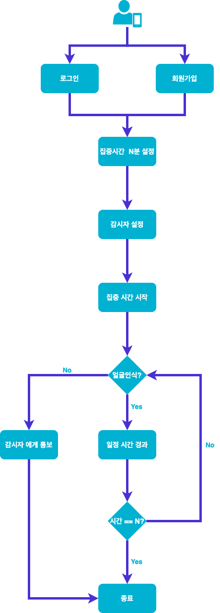

<!-- Image -->

# Mechanism

# Screen

<table>
  <tr><td><strong>Loading1</strong></td><td>
  <tr>
    <td>

</td>
  </tr>
  
  <tr><td><strong>Intro1</strong></td><td><strong>Intro2</strong></td></tr>
  <tr>
    <td>

</td>
    <td>

</td>
  </tr>
  <tr><td><strong>Intro3</strong></td><td><strong>Intro4</strong></td></tr>
  <tr>
    <td>

</td>
    <td>

</td>
  </tr>
  <tr><td><strong>Login</strong></td><td><strong>CreatAccount</strong></td></tr>
  <tr>
    <td>

</td>
    <td>

</td>
  </tr>
  <tr><td><strong>Home</strong></td><td><strong>Plan</strong></td></tr>
  <tr>
    <td>

</td>
    <td>

</td>
  </tr>
  <tr><td><strong>Camera</strong></td></tr><td><strong>FocusTime</strong></td></tr>
  <tr>
    <td>

</td>
    <td>

</td>
  </tr>
  <tr><td><strong>Result</strong></td><td><strong>PushNotification</strong></td></tr>
  <tr>
    <td>

</td>
    <td>

</td>
  </tr>
  <tr><td><strong>Ranking(Day)</strong></td><td><strong>Ranking(Week)</strong></td></tr>
  <tr>
    <td>

</td>
    <td>

</td>
  </tr>
  <tr><td><strong>Ranking(Month)</strong></td><td><strong>Ranking(Total)</strong></td></tr>
  <tr>
    <td>

</td>
    <td>

</td>
  </tr>
<tr><td><strong>DrawerContent</strong></td><td><strong>DrawerContent(Inviter)</strong></td></tr>
  <tr>
    <td>

</td>
    <td>

</td>
  </tr>
  <tr><td><strong>GroupList</strong></td><td><strong>GroupChat</strong></td></tr>
  <tr>
    <td>

</td>
    <td>

</td>
  </tr>
  <tr><td><strong>Observer</strong></td><td><strong>Profile</strong></td></tr>
  <tr>
    <td>

</td>
    <td>

</td>
  </tr>
  <tr><td><strong>CreateDiary</strong></td><td><strong>EditDiary</strong></td></tr>
  <tr>
    <td>

</td>
    <td>

</td>
  </tr>
  <tr><td><strong>EditProfile</strong></td><td><strong>Modal</strong></td></tr>
  <tr>
    <td>

</td>
    <td>

</td>
  </tr>
</table>
